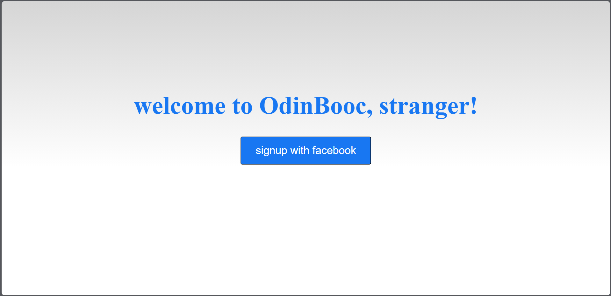
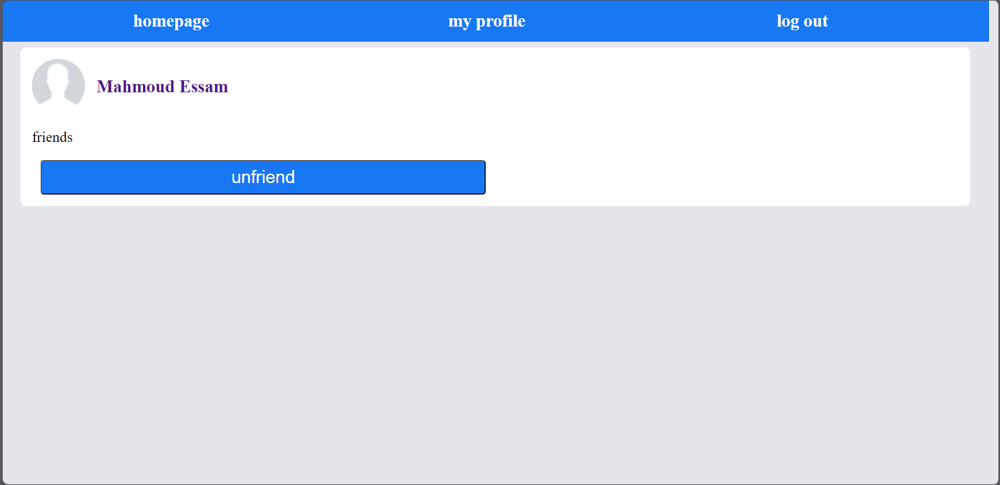
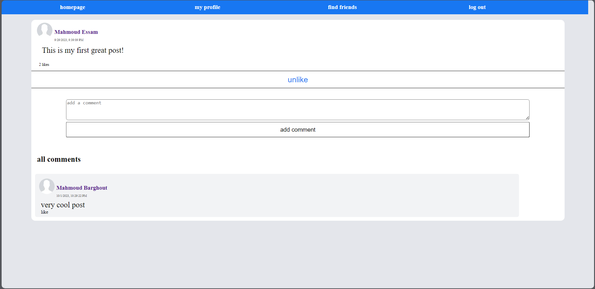
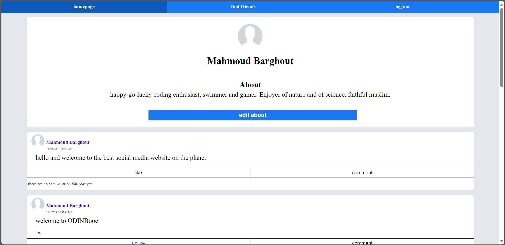
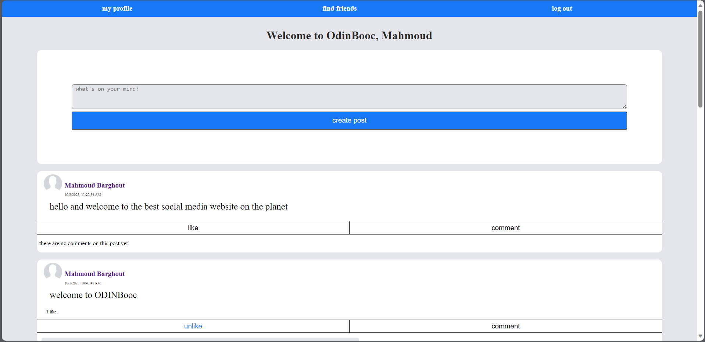

# OdinBook
## About 
Final Project of The Odin project node js curriculum. Facebook clone website with the ability to sign in with actual facebook data, create posts ,add other users, and interact with their posts.
[Live Link](https://odin-book-l3sc.onrender.com/)
## Detailed features

1. authenticate users with facebook Sign-in .
2. Compose new posts.
3. Update profile data.
4. view other users and add them as friends.
5. view others' post on a newsfeed and interacting with them by liking and commenting on them.

## Tech Stack

Tools used for this project:

1. Node js.
2. Express js.
3. Passportjs.
4. Passport-Facebook.
5. Ejs

## SreenShots

